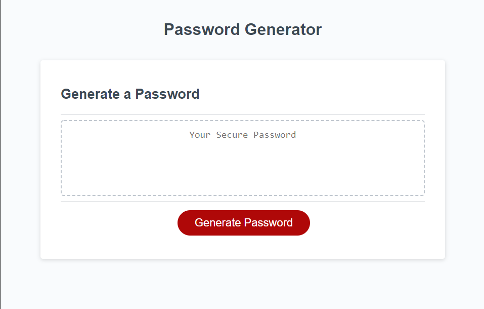

# RandomPasswordGenerator

**_Click the image below for deployed link_**

## **Table of Contents**
* How it works
* How to use

### **How it Works**
When the user clicks the generate button they will be prompted to for how long the password should be. Following the desired length the user will be alerted to confirm what type of characters are desired to be in the password. 

Once the user has given the desired information the application will randomly choose from a list of character types that the user wanted up to the desired password length. This will then be displayed into the web page above the `Generate Password` button. There will be at least one of each character type the user desired.

### **How to Use**
1) Click `Generate Password`
2) When prompted enter a number between 8 and 128. This determines how long to make the password.
3) Confirm by clicking `Ok` or `Cancel` for lowercase characters.
4) Confirm by clicking `Ok` or `Cancel` for uppercase characters.
5) Confirm by clicking `Ok` or `Cancel` for number characters.
6) Confirm by clicking `Ok` or `Cancel` for special characters.